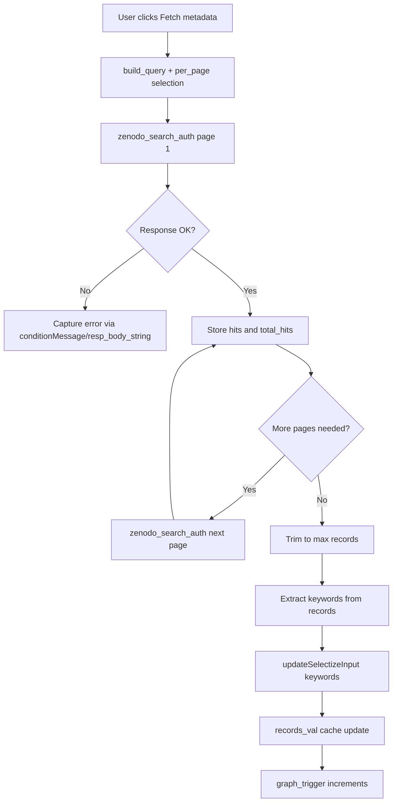

# Shiny_ZenodMap

Source code for a minimal [Shiny app](https://rmkrug.shinyapps.io/shiny_zenodmap/) to explore Zenodo records as a network graph.

The app is available on the [shinyapps.io](https://rmkrug.shinyapps.io/shiny_zenodmap/) but can also be run locally. 

# AI Usage disclaimer
The development of this app was mailnby done by ChatGPT 5.2 (CODEX extension in Positron). There has not been any detailed code review yet.

## Run Locally

```r
shiny::runApp()
```

## Package

This project is structured as an R package named `zenodoMap`. You can run the app with:

```r
zenodoMap::run_app()
```

## Notes

## Usage

- Click "Fetch metadata" to load records and populate the keyword list.
- Or upload an existing records list via "Upload data (RDS)" to skip fetching.
- Adjust graph options (depth, relations, keywords), then click "Refresh graph".
- Fetching metadata also triggers a graph refresh.

## Notes

- Default community id is `ipbes` (IPBES community). You can add extra query terms.
- Expansion depth is selectable (0-2). Expansion follows Zenodo DOIs only and is capped for performance.
- Zenodo limits unauthenticated page size to 25; add a token to raise it to 100 per page.
- Keyword filter is populated from record keywords and supports multi-select.
- Relation type filter is optional; select "All" to include every relation.
- Nodes are colored by community vs external deposits; enable "Only community-to-community links" to hide external nodes/edges.
- Use "Save data (RDS)" to choose a save location for fetched metadata (requires `shinyFiles`).
- Metadata table uses the `DT` package.
- DOI columns in the table are clickable; related items include the relation label.
- Concept DOIs in relations are mapped to the latest version found in the fetched records.

## Fetch flow


